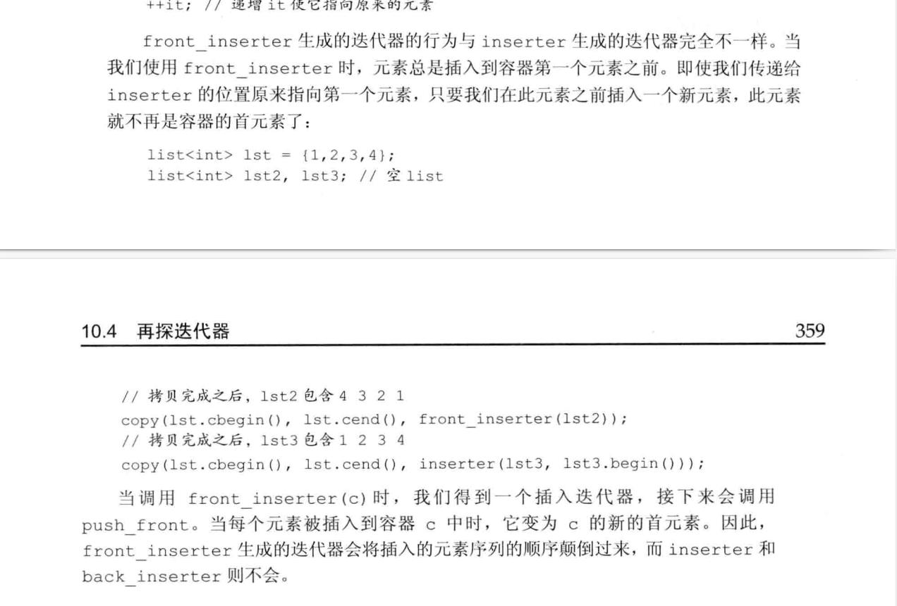

### Chapter 10  答疑
- 答疑问题


  1. vector扩容机制
      答：扩容机制当目标size超过当前size的时候，会调用append函数，append函数的机制为：
      ```
      1. 如果当前的capacity能够满足target size， 则不进行扩容
      2. 如果当前的capacity不够装target size，则进行扩容
            扩容的算法 _M_check_len,机制：
            const size_type __len = size() + std::max(size(),__n);
            // 当前大小 + (当前大小与要增加容量的最大值）  size()当前容量，__n为要扩容的量，__len 为新的capacity

            // 例子1：size == 3, capacity == 4,如果要resize为5，则__n = 5 - 4 = 1,
            //  则__len = size() + size() = 3 + 3 =6,故capacity会被置为6.
            // resize和push_back都是这样的扩容逻辑
            // 这种方式的好处在于:
            //  1. 既能够保证push_back能够以两倍扩容(__n在push_back扩容中恒为1，则size()若不等于0的情况下，size() >= __n恒成立）
            //  2. 若当前容量很小，resize的目标值很大，如size == 3, capacity == 4,若要resize为100，若只有*2的机制则会扩容很多次，但是max(size(),__n) =max(3,100-4) = 96,可以一步扩容到位，避免重复*2.
      ```
      所以resize之后的capacity不一定是*2。

  2. front_inserter 和 inserter的区别
      front_inserter（）可以看成针对从begin到end每个元素单独顺次调用push_front,所以会逆序。
      inserter(lst,lst.begin()) 可以看成insert可以插入一段的序列，一次插完，所以顺序不变。
      

  3.  Lambda 函数定义前面的auto是什么类型？
   答：auto会有类型推导，是个匿名类的函数对象。

   ```
   auto f = []{
      i++;
   }

   //可以看成生成了
   // class Demoxxxx{
   //    void operator(){
   //        i++;
   //    }
   //}

   // 调用的时候可以看成调用了 Demoxxxx()
   ```
  4. 谓词 ： 对迭代器所指向元素的判断
  5. 谓词的使用为什么不加括号：
   ```
   sort(vec.begin(),vec.end(),isShorter)； // isShorter 是个函数对象
                                           // isShorter()就是函数调用了
   ```

  6. 接受可调用对象作为参数的函数该如何写？
   ```
    //std::function<bool(int, double)> 为可调用对象的参数类型
    //bool对应可调用对象的返回值类型
    //（int, double）中的数量与类型与应可调用对象的参数列表对应
    func(std::function<bool(int, double)> f) {
        //code
    }
   ```

  7. 教材中文版勘误
   

  8. C++ sort函数：对容器或普通数组中 [first, last) 范围内的元素进行排序，默认进行升序排序；可以自定义谓词实现不同的sort（例如降序排序）。
