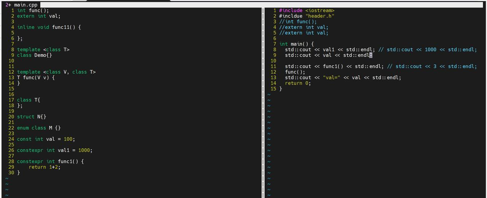

### Chapter 2  答疑
- 答疑问题

  1.  const、constexpr 和宏定义
    宏定义：在预处理阶段展开，没有类型，不做类型检查，仅仅是展开。
    constexpr: 在编译期使用常量替换掉变量
    const并未区分出编译期常量和运行期常量

  2. String的存储方式 ：SSO 短的字符串（算上\n小于等于16个字符）在栈上，长的字符串在堆上

  3. 不管string的长度是多少，sizeof(string)始终等于32。（里面存的是指针,32与编译器相关)

  4. 编译单元：不同的cpp即不同的编译单元

  5. 使用变量之前必须先声明，使用其他编译单元中定义的（全局）变量前先使用extern声明

  6. header-only的库将时间消耗放在编译期，编译期更轻量化

  7. 为什么内联函数可以解决多重定义的问题？
      单一定义规则：一个类、模板或内联函数的两个定义是可以被接受、被认为是相同唯一定义，当且仅当如下条件成立：
      1，他们出现在两个不同的编译单元中，且
      2，他们的源码逐单词对应，完全一样，且
      3，这些单词在两个编译单元中的含义完全一样。

  8. 范围for循环中，" ："取得是“ ：”号后面数组中的元素

  9. vector和string的size()函数，返回值得类型是size_type类型，这一类型与平台有关

  10. 常用的二进制符号检查工具：nm readelf objdump

  11. 类型推断
    

  12. 建议放在头文件的类型：
   
