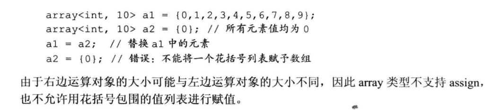

### Chapter 7  答疑
- 答疑问题


  1. deque可以看成是array和list的结合体
     

  2. insert之后迭代器是否有效需要看内存中是否有变化（譬如扩容），可以把迭代器看成指针，如果指针指向的区域发生变化迭代器会失效。

  3. 原则：for_each操作中尽量不要insert和erase

   ```
   for(auto x:v){
      v.push_back(iii); // 不要这样做
   }
   ```


  4. vector的扩容机制：在原有的capacity基础上乘以一定的系数（默认是2）

  5. clear 和 swap的区别：推荐swap
  ```
     std::vector<int> vec;

     vec.clear(); // 容量是不会变的，只是size()=0,会调用成员的析够函数

     std::vector<int>().swap(vec); //会释放容量capacity，那块内存区域会被释放，也会析构
  ```

  6. clear的时间复杂度：与成员的析构函数的复杂度有关（例如，析构的时间复杂度是O(m),则clear的时间复杂度O(mn))

  7. vector不管是否为静态变量（即不管是放在数据段还是栈上），vector里面的数据均存放在堆上（系统栈的容量是有限的）
  ```
     #include <iostream>
     #include <vector>

     vector<int> a; //a存放在数据段，a的数据在堆上

     int main()
     {
     std::vector<int> v; //v存放在栈上，v的数据在堆上
     std::cout << sizeof(v) << endl; //无论v的size是多少，sizeof(v)始终是固定大小
     }
  ```

  8. array<int,6>和array<int,4>是不同的类型，不存在扩容，行为就是数组行为。所以vector的swap交换的是指针，array的swap是数据内存的拷贝。

  9.
   

  10. 容器都是线程不安全的，多线程操作可能会出现内存容量等修改之后踩内存，core dump的问题。

  11. resize VS push_back : resize一次性申请容量内存，push_back会符合vector扩容机制。

  12. 对于已知长度的vector，使用reserve指定容量，避免重新分配内存带来的问题。

  13. vector扩容机制详见同文件夹下《vector扩容机制（基于gcc 9.4.0源码）.pdf》
