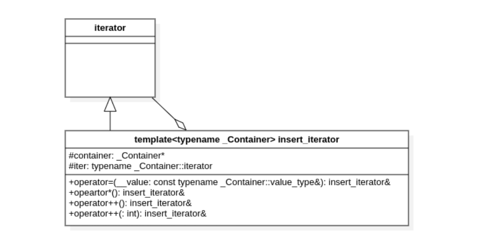

# STL:深入理解迭代器适配器insertion、front_insertion

## 代码示例(c++ primer 10.4.1章节)

```c++
list<int> lst = {1, 2, 3, 4};
list<int> lst2, lst3; // empty lists
// after copy completes, lst2 contains 4 3 2 1
copy(lst.cbegin(), lst.cend(), front_inserter(lst2));
cout << "lst2:";
for (auto &&elem : lst2) {
    cout << elem << " ";
}
cout << endl;

// after copy completers, lst3 contains 1 2 3 4
copy(lst.cbegin(), lst.cend(), inserter(lst3, lst3.begin()));
cout << "lst3:";
for (auto &&elem : lst3) {
    cout << elem << " ";
}
cout << endl;
```

## 迭代器适配器与迭代器的类图关系



insert_iterator内存在一个成员变量，容器的迭代器iter，我们说insert_iterator是对iter的一种适配器；适配器是一种常见的结构型设计模式: 主要是将一个类的接口转换成客户希望的另外一个接口。

## 源码之前，了无秘密

### 先来看copy函数的实现

```c++
/**
   *  @brief Copies the range [first,last) into result.
   *  @ingroup mutating_algorithms
   *  @param  __first  An input iterator.
   *  @param  __last   An input iterator.
   *  @param  __result An output iterator.
   *  @return   result + (last - first)
   *
   *  This inline function will boil down to a call to @c memmove whenever
   *  possible.  Failing that, if random access iterators are passed, then the
   *  loop count will be known (and therefore a candidate for compiler
   *  optimizations such as unrolling).  Result may not be contained within
   *  [first,last); the copy_backward function should be used instead.
   *
   *  Note that the end of the output range is permitted to be contained
   *  within [first,last).
  */
template<typename _II, typename _OI>
inline _OI copy(_II __first, _II __last, _OI __result)
{
    // concept requirements
    __glibcxx_function_requires(_InputIteratorConcept<_II>)
        __glibcxx_function_requires(_OutputIteratorConcept<_OI,
                                    typename iterator_traits<_II>::value_type>)
        __glibcxx_requires_can_increment_range(__first, __last, __result);

    return std::__copy_move_a2<__is_move_iterator<_II>::__value>
        (std::__miter_base(__first), std::__miter_base(__last), __result);
}

// 最终执行的逻辑代码，也就是对[first, last)进行遍历，然后赋值给result，此时我们需要关注result的operator++()、operator*()、operator=()方法
static _OI __copy_m(_II __first, _II __last, _OI __result)
{
    for (; __first != __last; ++__result, (void)++__first)
        *__result = *__first;
    return __result;
}
```

我们列出for循环中一次迭代过程:

```c++
if(__first != _last) {
	(*__result_) = (*__first); // 等价于(__result.operator*()).operator=(*__first);
    ++__result; // 等价于 __result.operator++();
    ++__first;
}
```

### 再看insert_iterator的实现

我们这次聚焦operator++()、operator*()、operator=()这几个函数的实现

```c++
/// Simply returns *this.
insert_iterator& operator*() { return *this; }

/// Simply returns *this.  (This %iterator does not @a move.)
insert_iterator& operator++() { return *this; }

/// Simply returns *this.  (This %iterator does not @a move.)
insert_iterator& operator++(int) { return *this; }

// 左值版本
insert_iterator& operator=(const typename _Container::value_type& __value)
{
    iter = container->insert(iter, __value);
    ++iter;
    return *this;
}
// 右值版本
insert_iterator& operator=(typename _Container::value_type&& __value)
{
    iter = container->insert(iter, std::move(__value));
    ++iter;
    return *this;
}
```

我们可以看到insert_iterator的operator*()、operator++()、operator++(int)没有对容器做什么操作，直接返回insert_iterator的this对象；那么奥妙全在operator=上：

```c++
iter = container->insert(iter, __value); // 调用容器的insert方法，返回插入后的迭代器位置
++iter; // 然后将迭代器位置向尾部移动一位，关键的一步，确保插入一个数据后，iter还是之前的插入点
return *this;
```

### 根据源码，进行代码演练

### inserter

```c++
list<int> lst = {1, 2, 3, 4};
list<int> lst2, lst3; // empty lists
// after copy completers, lst3 contains 1 2 3 4
copy(lst.cbegin(), lst.cend(), inserter(lst3, lst3.begin()));
cout << "lst3:";
for (auto &&elem : lst3) {
    cout << elem << " ";
}
```

这里inserter(lst3, lst3.begin()), 构造出一个insert_iterator的对象，此时该对象的**container为lst3，iter为lst3.begin();**

此时我们带入下面copy的一次迭代中

```c++
if(__first != _last) {
	(*__result) = (*__first); // 等价于(__result.operator*()).operator=(*__first);
    ++__result; // 等价于 __result.operator++();
    ++__first;
}
```

\__first为lst.cbegin(),  __last为lst.cend(),  \__result为insert_iterator;

```c++
// 等价于下面代码
auto __first = lst.cbegin();
auto __last = lst.cend();

auto container = lst3;
auto iter = lst3.begin();
iter = container->insert(iter, *__first);
iter++; // 插入完一次后，iter又回到了lst3.begin(); lst3最后是1 2 3 4
```

### front_inserter

与inserter的实现很相似，我们来看它的几个关键函数，

```c++
/// Simply returns *this.
front_insert_iterator& operator*() { return *this; }

/// Simply returns *this.  (This %iterator does not @a move.)
front_insert_iterator& operator++() { return *this; }

/// Simply returns *this.  (This %iterator does not @a move.)
front_insert_iterator operator++(int) { return *this; }

front_insert_iterator& operator=(const typename _Container::value_type& __value)
{
    container->push_front(__value);
    return *this;
}

front_insert_iterator& operator=(typename _Container::value_type&& __value)
{
    container->push_front(std::move(__value));
    return *this;
}
```

示例代码

```c++
list<int> lst = {1, 2, 3, 4};
list<int> lst2, lst3; // empty lists
// after copy completes, lst2 contains 4 3 2 1
copy(lst.cbegin(), lst.cend(), front_inserter(lst2));
cout << "lst2:";
for (auto &&elem : lst2) {
    cout << elem << " ";
}
cout << endl;
```

此时我们带入下面copy的一次迭代中：

```c++
if(__first != _last) {
	(*__result) = (*__first); // 等价于(__result.operator*()).operator=(*__first);
    ++__result; // 等价于 __result.operator++();
    ++__first;
}
```

\__first为lst.cbegin(),  __last为lst.cend(),  \__result为front_insert_iterator;

```c++
// 等价于下面代码
auto __first = lst.cbegin();
auto __last = lst.cend();

auto container = lst2;
container->push_front(*__first);  // 将数据push到front， lst2最后是4 3 2 1
```

## 总结

迭代器适配，主要是对容器和容器的迭代器进行一层适配，达到另外一种功能接口的效果；结合stl的泛型算法，可以适配很多业务场景。
